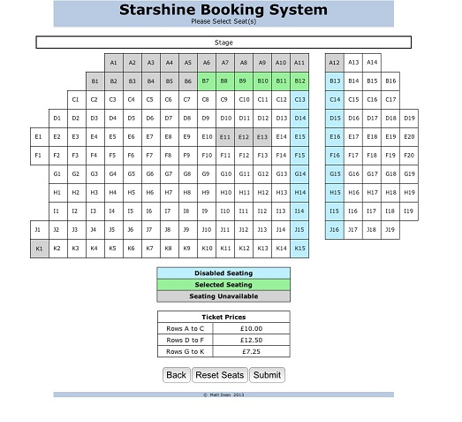
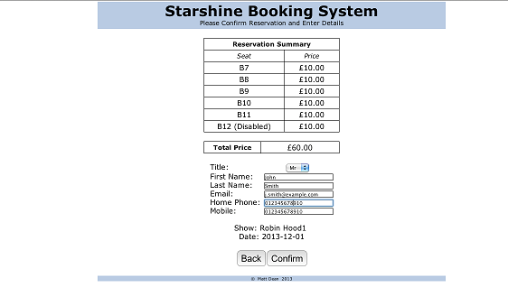
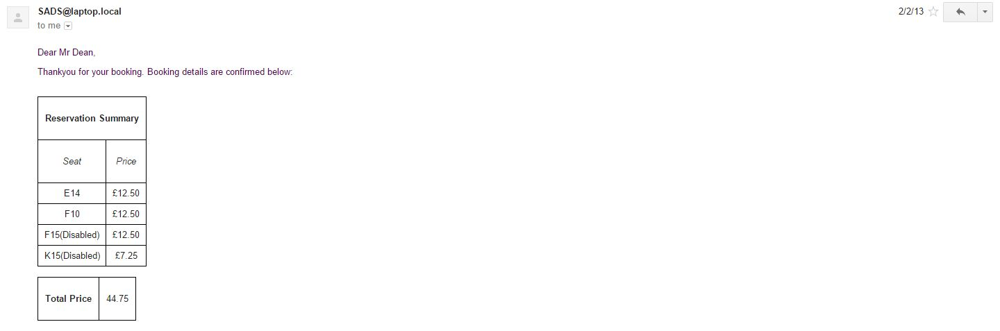

# starshine
a theatre ticket booking system for AS computing

###my first coding project!

Given a scenario, I created a system for a small local theatre that would allow customers to book seats.

Customers are first asked to select which show, and on what date they would like to attend.

They then select their seats:

and enter their details/confirm the reservation:

I then insert these details into the MySQL database, and update the seat booking info for that show/date.

The customer also recieves a confirmation email:

